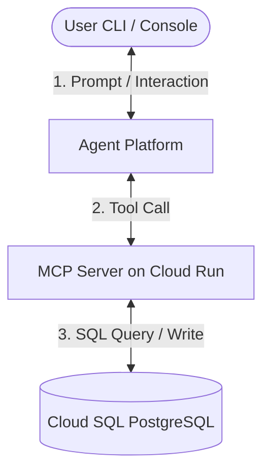

# Agent Platform Warehouse Workshop

This workshop demonstrates the capabilities of the **Agent Platform**. It builds a stateful **Warehouse Management Agent** that queries a Cloud SQL database through an MCP (Model Context Protocol) server running on Cloud Run, reasons over customer requests, and performs transactions.

### Key Capabilities Demoed
* **Native MCP Server Integration:** Connecting remote Model Context Protocol (MCP) servers securely to a cloud-managed agent.
* **FastMCP Tool Generation:** Effortlessly generating standardized MCP schemas from simple, type-hinted Python functions.
* **Stateful Tool Calling:** Demonstrating an agent's ability to reason, invoke tools sequentially, evaluate responses, and take conditional actions (e.g., verifying stock before allowing an order).
* **Local Emulation:** Rapidly developing and testing agents locally without the overhead of cloud deployment cycles.
* **Agent Provisioning:** Utilizing Agent Engine to create persistent, cloud-managed agents.

---

## Architecture Overview



---

## Prerequisites

If you are running this workshop locally, ensure you have the Google Cloud CLI (`gcloud`) installed and authenticated:
```bash
gcloud auth login
gcloud auth application-default login
```

Set the project you will use for this workshop:
```bash
export GOOGLE_CLOUD_PROJECT="YOUR_PROJECT_ID"
export GEAP_PREFIX="your_name" # A unique prefix for your resources (letters and numbers only)
gcloud config set project $GOOGLE_CLOUD_PROJECT
```

> [!TIP]
> **Cloud Shell Users**: If you are using **Google Cloud Shell**, you can skip running `gcloud auth login` or `gcloud auth application-default login` as you are already authenticated. You can also skip setting the project if Cloud Shell is already configured to your target project (verify by running `gcloud config get project`).

---

## GCP Project & IAM Setup

If you are using a new GCP project, you must enable the required Google Cloud APIs and ensure your user account has the appropriate permissions.

### 1. Required IAM Roles
The user account running this workshop requires the following IAM roles on the project:
* **Project IAM Admin** (`roles/resourcemanager.projectIamAdmin`) - to configure Service Account permissions.
* **Cloud Run Admin** (`roles/run.admin`) - to deploy the MCP server.
* **Cloud SQL Admin** (`roles/cloudsql.admin`) - to create and manage the PostgreSQL database.
* **Agent Platform Administrator** (`roles/aiplatform.admin`) - to create and run agents.
* **Cloud Trace Agent** (`roles/cloudtrace.agent`) - to export OpenTelemetry trace data to Cloud Trace.
* **Service Usage Admin** (`roles/serviceusage.serviceUsageAdmin`) - to enable Google Cloud APIs.
* **Storage Admin** (`roles/storage.admin`) - to create storage buckets for container builds.
* **Artifact Registry Administrator** (`roles/artifactregistry.admin`) - to store the built container images.

> [!NOTE]
> If you have the **Owner** (`roles/owner`) role on the project, you already have all the necessary permissions.

### 2. Enable Required APIs
Run the following command to enable all the necessary APIs:
```bash
gcloud services enable \
    sqladmin.googleapis.com \
    run.googleapis.com \
    artifactregistry.googleapis.com \
    aiplatform.googleapis.com \
    agentregistry.googleapis.com \
    apphub.googleapis.com \
    cloudbuild.googleapis.com \
    cloudtrace.googleapis.com \
    serviceusage.googleapis.com
```

---

## 1. Virtual Environment & Dependency Setup

> **Business Goal**: Establish a clean, isolated Python runtime environment to ensure consistent package dependencies, preventing conflicts between workshop libraries and existing system-level packages.

Create and activate a python virtual environment, then install dependencies:
```bash
python3 -m venv venv
source venv/bin/activate
pip install -r requirements.txt
```

> **Note on the OpenTelemetry pins:** `google-adk` 2.x requires `opentelemetry-api/sdk <= 1.42.1`,
> so the instrumentation and semantic-convention packages are pinned to the matching `0.63b1`
> line. If you bump them to `0.64b0`, pip silently resolves `google-adk` back down to `1.10.0`,
> and Section 4 Option C then fails locally with
> `TypeError: Runner.__init__() got an unexpected keyword argument 'app'`.

---

## 2. Create Cloud SQL Database & Seed Inventory

> **Business Goal**: Establish a secure, managed Cloud SQL database to act as our system of record, holding product inventories and customer orders. Prefixing the resources with your username ensures isolation so multiple users can run the workshop simultaneously in the same Google Cloud project.

1. Run the database creation script:
   ```bash
   bash scripts/create_db.sh
   ```
   
   > [!NOTE]
   > Creating a new Cloud SQL instance can take **5 to 10 minutes** to provision on Google Cloud. Subsequent runs of this script will be instant as it skips creation if the instance already exists.

### What is Executed:
* **Instance Creation:** Provisions a Cloud SQL PostgreSQL v15 database instance named `${USER}-warehouse-db` in region `us-central1` utilizing the lightweight `db-f1-micro` tier.
* **Database Setup:** Checks for and creates a PostgreSQL database called `warehouse`.
* **Table Creation & Seeding:** Triggers `scripts/setup_db.py` to establish connection using the Cloud SQL Python Connector and schema seeding:
  * Drops any pre-existing tables to ensure a clean state.
  * Creates an `inventory` table and an `orders` table.
  * Seeds the inventory with five futuristic warehouse products (e.g., *Quantum Compactor*, *Antigravity Boots*).

### Key Lines in Code:
* **Cloud SQL Instance Creation (`scripts/create_db.sh`):**
  ```bash
  gcloud sql instances create "${USER}-warehouse-db" \
      --database-version=POSTGRES_15 \
      --tier=db-f1-micro \
      --region="us-central1" \
      --root-password="super-secret-password" \
      --quiet
  ```
* **Database Seeding and Python Connection (`scripts/setup_db.py`):**
  ```python
  from google.cloud.sql.connector import Connector, IPTypes
  import getpass
  username = getpass.getuser()
  connector = Connector()

  def getconn():
      return connector.connect(
          f"{project}:us-central1:{username}-warehouse-db",
          "pg8000",
          user="postgres",
          password="super-secret-password",
          db="warehouse",
          ip_type=IPTypes.PUBLIC
      )

  engine = sqlalchemy.create_engine("postgresql+pg8000://", creator=getconn)
  ```

---

## 3. Deploy & Expose FastMCP Server on Cloud Run

> **Business Goal**: Package the database access logic into a standardized, web-accessible Model Context Protocol (MCP) server running on Cloud Run, and enroll the tools (such as `list_inventory` and `create_order`) into the Google Agent Registry. This establishes a secure interface enabling LLM agents to safely interact with database records.

1. Build and deploy the FastMCP server code to Cloud Run, and set up database connection permissions:
   ```bash
   bash scripts/deploy_mcp_server.sh
   ```
   Save the output `MCP_SERVER_URL` in your terminal. The FastMCP server speaks
   **Streamable HTTP** and is mounted at `/mcp` (there is no `/sse` endpoint):
   ```bash
   export MCP_SERVER_URL="https://${GEAP_PREFIX}-warehouse-mcp-server-xxxx-uc.a.run.app/mcp"
   ```

2. Register the deployed service in the Agent Registry:
   ```bash
   python3 scripts/register_mcp_server.py
   ```

### What is Executed:
* **IAM Grants:** Finds your project number and grants the default Compute Engine service account (`{PROJECT_NUMBER}-compute@developer.gserviceaccount.com`) several critical roles (`roles/cloudsql.client`, `roles/storage.objectViewer`, `roles/logging.logWriter`, `roles/artifactregistry.writer`) so Cloud Build can read the sources, compile, and push the Docker container successfully.
* **Cloud Run Deployment:** Deploys `${USER}-warehouse-mcp-server` from the local `mcp_server` directory. It configures the Cloud Run instance to mount the Cloud SQL connection (`add-cloudsql-instances`) and sets connection variables (`DB_USER`, `DB_PASS`, `DB_NAME`, `INSTANCE_CONNECTION_NAME`).
* **Agent Registry Enrollment:** Executes `register_mcp_server.py` to register the MCP tools schema (e.g., `list_inventory`, `create_order`) with the Google Enterprise Agent Registry.

### Key Lines in Code:
* **IAM Grant Permissions (`scripts/deploy_mcp_server.sh`):**
  ```bash
  gcloud projects add-iam-policy-binding "$GOOGLE_CLOUD_PROJECT" \
      --member="serviceAccount:${SERVICE_ACCOUNT}" \
      --role="roles/storage.objectViewer" --quiet
  ```
* **Cloud Run Server Deployment (`scripts/deploy_mcp_server.sh`):**
  ```bash
  gcloud run deploy "${USER}-warehouse-mcp-server" \
      --source mcp_server \
      --region us-central1 \
      --add-cloudsql-instances "${GOOGLE_CLOUD_PROJECT}:us-central1:${USER}-warehouse-db" \
      --set-env-vars "DB_USER=postgres,DB_PASS=super-secret-password,DB_NAME=warehouse,INSTANCE_CONNECTION_NAME=${GOOGLE_CLOUD_PROJECT}:us-central1:${USER}-warehouse-db" \
      --allow-unauthenticated --quiet
  ```

---

## 4. Warehouse Agent Implementation & Execution

> **Business Goal**: Implement and execute the core agent loop. Option A lets you test changes rapidly via local emulation, Option B deploys a secure, enterprise-grade cloud-hosted agent, and Option C packages the agent logic into a custom sandbox container using the Agent Development Kit (ADK).

Choose **Option A (Local Emulation - Recommended)** or **Option B (Cloud Managed Agent)** depending on your GCP organizational permissions:

### Option A: Local Agent Emulation (Works out-of-the-box)
In Local Emulation, you bypass cloud-provisioning completely. The **Local Agent Client** runs the conversational and function-calling loop directly on your workstation using the standard Gemini API (`gemini-3.5-flash`), loading tool specifications directly from your deployed Cloud Run MCP server. This is the recommended approach for rapid local development and testing before pushing an agent to production.

```bash
export MCP_SERVER_URL="YOUR_CLOUD_RUN_URL/mcp"
python3 scripts/local_agent.py
```

#### What is Executed:
* **OAuth / OIDC Authentication:** Checks if the target `MCP_SERVER_URL` points to an authenticated `.run.app` service. If so, it requests a secure Google OIDC ID Token for the Cloud Run audience and attaches it as an `Authorization` header, bypassing corporate *Domain Restricted Sharing* restrictions.
* **Tool Mapping:** Fetches the database tool schemas from the MCP server and maps them to standard Gemini `FunctionDeclaration` parameters.
* **Stateful Chat Loop:** Initiates a text loop, passing prompts to Gemini and intercepting requested tool calls, calling the MCP server over Streamable HTTP, and returning database results back to the model.

#### Key Lines in Code:
* **OIDC Secure Token Retrieval (`scripts/local_agent.py`):**
  ```python
  import google.oauth2.id_token
  from google.auth.transport.requests import Request

  audience = mcp_url.split("/mcp")[0]
  token = google.oauth2.id_token.fetch_id_token(Request(), audience)
  headers["Authorization"] = f"Bearer {token}"
  ```
* **Mapping MCP Schema to Gemini Function Declarations (`scripts/local_agent.py`):**
  ```python
  tools_result = await session.list_tools()
  for tool in tools_result.tools:
      fd = genai_types.FunctionDeclaration(
          name=tool.name,
          description=tool.description,
          parameters=tool.inputSchema
      )
      func_declarations.append(fd)
  ```

---

### Option B: Cloud-Managed Agent
You can also create a permanent cloud-managed agent hosted by Agent Engine. Because your Cloud Run MCP server is protected by Google Cloud IAM (Domain Restricted Sharing), the Agent Platform requires valid credentials to connect to it.

```bash
export MCP_SERVER_URL="YOUR_CLOUD_RUN_URL/mcp"
python3 scripts/create_agent.py
python3 scripts/interact_agent.py
```

> **⚠️ Known limitation (preview):** the managed base agent currently answers plain prompts
> in a few seconds, but interactions that need one of the registered `mcp_server` tools can
> stay in `in_progress` indefinitely — no request ever reaches the Cloud Run service. This
> reproduces with the `/mcp`, base and `/sse` URL forms alike and with or without an
> injected `Authorization` header, so it is a platform-side issue rather than a
> configuration error in this workshop. `verify_workshop.py --remote` therefore gives up
> after `INTERACTION_TIMEOUT_SECONDS` (default 300) instead of hanging. Use **Option A** or
> **Option C** if you need a working end-to-end tool-calling demo.
>
> Note also that `base_environment.network.allowlist` only accepts `{"domain": "*"}` today;
> narrowing it to the Cloud Run hostname is rejected with
> `400 INVALID_ARGUMENT: Only domain: '*' is supported now.`

#### What is Executed:
* **Token Retrieval & Injection:** Dynamically fetches a Google Identity token via `gcloud auth print-identity-token` and injects it into the `headers` field of the `mcp_server` tool definition. This allows Agent Engine to authenticate with the Cloud Run service.
* **Agent Provisioning:** Initiates a call to Agent Engine (`client.agents.create`) using the base agent model (`antigravity-preview-05-2026`). It registers your Cloud Run MCP server URL and injected headers as a remote toolset.
* **Operation Polling:** It monitors and polls the long-running operation until the agent container is fully ready.

#### Key Lines in Code:
* **Configuring MCP Server Authentication (`scripts/create_agent.py`):**
  ```python
  import getpass
  username = getpass.getuser()
  token = subprocess.check_output(["gcloud", "auth", "print-identity-token"]).decode().strip()
  
  operation = client.agents.create(
      id=f"{username}-warehouse-manager",
      base_agent="antigravity-preview-05-2026",
      system_instruction="You are a warehouse management assistant...",
      tools=[{
          "type": "mcp_server", 
          "name": f"{username}-warehouse-db", 
          "url": mcp_url,
          "headers": {"Authorization": f"Bearer {token}"}
      }],
      timeout=1200 # Overrides default method timeout (20 mins)
  )
  ```

---

### Option C: Agent Engine (ADK Python Custom Agent)
Alternatively, you can package the agent inside a custom Python class and deploy it using the **Agent Platform Agent Engine (ADK)**. 

Because Agent Engine uploads the pickled python code and installs custom requirements in a pre-built container in the cloud, it is a robust alternative when you need direct control over the execution loop and dependency configuration. It is also more resilient during platform-level Tenant Project Pool outages.

#### 1. How to Test the ADK Agent Locally:
You can verify the agent class structure entirely locally (which mocks the remote container execution path):
```bash
source venv/bin/activate
export GOOGLE_CLOUD_PROJECT="YOUR_PROJECT_ID"
export GEAP_PREFIX="your_name"
export MCP_SERVER_URL="https://YOUR_CLOUD_RUN_SERVICE-uc.a.run.app/mcp" # The Streamable HTTP endpoint
python3 scripts/adk_agent.py
```

#### 2. How to Deploy the ADK Agent to Agent Platform:
To deploy the Python class as a remote Agent Engine instance:
```bash
source venv/bin/activate
export GOOGLE_CLOUD_PROJECT="YOUR_PROJECT_ID"
export GEAP_PREFIX="your_name"
export STAGING_BUCKET="gs://YOUR_PROJECT_ID-agent-engine-staging" # Staging bucket to upload pickle files
export MCP_SERVER_URL="https://YOUR_CLOUD_RUN_SERVICE-uc.a.run.app/mcp" # The Streamable HTTP endpoint
python3 scripts/adk_agent.py --deploy
```

> **Create the staging bucket first** if you do not have one. Use a regular bucket -- the
> legacy `gs://staging.PROJECT_ID.appspot.com` bucket is owned by App Engine and uploads to
> it fail with `403 ... You must verify site or domain ownership`:
> ```bash
> gcloud storage buckets create "$STAGING_BUCKET" --location=us-central1
> ```
This will print the successfully deployed resource name (e.g. `projects/YOUR_PROJECT_NUMBER/locations/us-central1/reasoningEngines/YOUR_ENGINE_ID`).

#### 3. How to Interact with the Deployed Remote Agent:
We provide an interactive CLI client script to query and chat with the deployed remote agent:
```bash
source venv/bin/activate
export GOOGLE_CLOUD_PROJECT="YOUR_PROJECT_ID"
export GEAP_PREFIX="your_name"
export REASONING_ENGINE_NAME="YOUR_DEPLOYED_REASONING_ENGINE_RESOURCE_NAME"
python3 scripts/interact_adk_agent.py
```

---

### Option D: Call the Agent Engine Agent Through a Gemini Enterprise App

> **Business Goal**: Publish the agent to end users. Registering the reasoning engine as an
> agent inside a **Gemini Enterprise** app puts it in the same chat surface as the rest of
> the organisation's agents, and makes it reachable from the public Discovery Engine API
> that the Gemini Enterprise web UI itself uses — no Vertex AI SDK required on the client.

First register the deployed reasoning engine in your Gemini Enterprise app (Agents → Add
agent → ADK agent → point it at `projects/.../reasoningEngines/YOUR_ENGINE_ID`). Then:

```bash
source venv/bin/activate
export GOOGLE_CLOUD_PROJECT="YOUR_PROJECT_ID"

# 1. Find your Gemini Enterprise app (engine) ID
python3 scripts/ge_agent.py --list-apps
export GE_ENGINE_ID="gemini-enterprise-xxxxxxxx_xxxxxxxxxxxxx"

# 2. Find the agent ID your reasoning engine was registered under
python3 scripts/ge_agent.py --list
#   8420417736921100318  ENABLED  adkAgentDefinition  GEAP Warehouse Agent  -> reasoningEngine 8831015160773607424

# 3. Talk to it
export GE_AGENT_ID="8420417736921100318"
python3 scripts/ge_agent.py "List all items in the warehouse inventory."

# 4. Multi-turn: feed the returned session back in
python3 scripts/ge_agent.py --session "projects/.../sessions/1080620116372672296" \
    "Place an order for 5 Antigravity Boots (Product ID 3) for customer 'GE Test'."
```

#### What is Executed:
* **Assistant Endpoint:** Posts to `{assistant}:streamAssist` on `discoveryengine.googleapis.com`.
  The Gemini Enterprise web UI sends a large internal payload to this same endpoint
  (`configId`, `experimentIdsForLogging`, `additionalParams`, ...); almost none of it is
  required from an API client.
* **Agent Routing:** `agentsSpec.agentSpecs[].agentId` is what routes the turn to a specific
  agent. **Without it the default orchestrator answers the question itself** and never
  reaches your agent — it will say it has no access to your warehouse database. The field is
  accepted on `v1` (GA), `v1beta` and `v1alpha` alike.
* **Sessions:** The first turn mints a session and returns it in `sessionInfo.session`.
  Multi-turn is simply passing that resource name back as `session`. This is a Discovery
  Engine session, separate from the Agent Engine managed sessions used by Option C.
* **Tool Execution:** Unchanged — the reasoning engine still calls your Cloud Run MCP server,
  which still talks to Cloud SQL. Gemini Enterprise is only the front door.

#### Key Lines in Code:
* **Routing to a specific agent (`scripts/ge_agent.py`):**
  ```python
  body = {"query": {"text": text}}
  if agent_id:
      body["agentsSpec"] = {"agentSpecs": [{"agentId": agent_id}]}
  if session:
      body["session"] = session
  r = requests.post(f"{BASE}:streamAssist", headers=headers(), json=body, timeout=300)
  ```

> **Note:** the agents collection is only exposed on `v1alpha`, so `--list` uses that
> version while the actual conversation uses `v1`.

---

## 5. Deploy an Existing LangChain Agent on Agent Platform

> **Business Goal**: Leverage the Agent Platform to deploy and run pre-existing LangChain agent workflows. This allows you to migrate legacy agent logic directly to production-grade managed infrastructure while preserving investments in existing LangChain orchestration code.

Alternatively, you can deploy an existing LangChain agent using the pre-built `vertexai.preview.reasoning_engines.LangchainAgent` template class. Under the hood, this compiles your prompt templates, ChatVertexAI model configs, and Python function tools into a structured LangChain `AgentExecutor`.

We provide a complete sample in `scripts/langchain_agent.py`.

### 1. How to Test the LangChain Agent Locally:
Verify that the model correctly binds your tools and queries locally:
```bash
source venv/bin/activate
export GOOGLE_CLOUD_PROJECT="YOUR_PROJECT_ID"
export GEAP_PREFIX="your_name"
python3 scripts/langchain_agent.py
```

### 2. How to Deploy the LangChain Agent to Agent Platform:
Deploy the compiled LangChain graph to the cloud under Agent Engine:
```bash
source venv/bin/activate
export GOOGLE_CLOUD_PROJECT="YOUR_PROJECT_ID"
export GEAP_PREFIX="your_name"
export STAGING_BUCKET="gs://YOUR_PROJECT_ID-agent-engine-staging"
python3 scripts/langchain_agent.py --deploy
```
This will output the remote resource name of your deployed LangChain agent:
`Resource Name: projects/YOUR_PROJECT_NUMBER/locations/us-central1/reasoningEngines/YOUR_ENGINE_ID`

### 3. How to Query the Deployed LangChain Agent:
You can load the remote agent by its ID and query it from any script:
```python
import vertexai
from vertexai.preview import reasoning_engines

vertexai.init(project="YOUR_PROJECT_ID", location="us-central1")
agent = reasoning_engines.ReasoningEngine("projects/YOUR_PROJECT_NUMBER/locations/us-central1/reasoningEngines/YOUR_ENGINE_ID")
response = agent.query(input="How many letters are in the word supercalifragilisticexpialidocious?")
print(response)
```

---

## 6. End-to-End Automated Workshop Verification

> **Business Goal**: Programmatically verify agent integration across various transactional use cases. By testing multi-turn flows (listing stock, querying single items, attempting invalid and valid order submissions), we guarantee the agent behaves reliably and adheres to stock availability rules.

Run the automated verification script to execute the five warehouse scenarios sequentially.

To run verification in **Local Emulation** mode (Option A):
```bash
export MCP_SERVER_URL="YOUR_CLOUD_RUN_URL/mcp"
python3 scripts/verify_workshop.py
```

To run verification using the **Cloud-Managed Agent** (Option B):
```bash
python3 scripts/verify_workshop.py --remote
```
This mode is subject to the managed-agent tool-calling limitation described in
[Option B](#option-b-cloud-managed-agent) above; each interaction is abandoned after
`INTERACTION_TIMEOUT_SECONDS` (default 300).

To run verification using the **Reasoning Engine ADK Agent** (Option C):
```bash
python3 scripts/verify_workshop.py --adk "YOUR_DEPLOYED_REASONING_ENGINE_RESOURCE_NAME_OR_ID"
```


### What is Executed:
The script automates five stateful interactions with the agent to verify database transactions and tool calling:
1. **List inventory**: Invokes `list_inventory` on the database to print initial items.
2. **Query product stock**: Checks details of Product ID 3 (Antigravity Boots).
3. **Invalid order (Over-stock)**: Attempts to order 1000 Antigravity Boots. Verification ensures the agent correctly calls `create_order` and rejects it due to insufficient stock.
4. **Valid order**: Orders 5 Antigravity Boots for customer "Verification Test", which decrements the database inventory level.
5. **Re-check stock**: Confirms the database inventory level was updated to 0.

<details>
<summary><b>📋 Sample Automated Verification Output (Click to expand)</b></summary>

```text
============================================================
 RUNNING WAREHOUSE AGENT VERIFICATION
============================================================

============================================================
 1. LISTING INITIAL INVENTORY
============================================================
User: List all items in the warehouse inventory.
Agent: Warehouse Inventory:
- ID: 1 | Quantum Compactor | Qty: 15 | Price: $1200.00
  Description: Industrial grade spatial compression unit for storage optimization.
- ID: 2 | Neural Interface Collar | Qty: 42 | Price: $350.00
  Description: Direct cybernetic link collar for instant warehouse worker communication.
- ID: 3 | Antigravity Boots | Qty: 5 | Price: $899.99
  Description: Personal gravity dampening boots allowing easy vertical reach in tall stacks.
- ID: 4 | Plasma Cutter 3000 | Qty: 8 | Price: $450.00
  Description: High-precision laser cutter for heavy crate opening.
- ID: 5 | Sub-Space Teleporter | Qty: 2 | Price: $4999.00
  Description: Short-range instant item transport pad for ultra-fast picking.

============================================================
 2. QUERYING STOCK OF PRODUCT ID 3
============================================================
User: Check the current stock level of Antigravity Boots (Product ID 3).
Agent: Product: Antigravity Boots (ID: 3) | Current Stock: 5 units | Price: $899.99

============================================================
 3. ATTEMPTING INVALID ORDER (EXCESSIVE STOCK)
============================================================
User: Place an order for 1000 Antigravity Boots for customer 'Verification Test'.
Agent: Insufficient stock for product 'Antigravity Boots' (ID: 3). Requested: 1000, Available: 5.

============================================================
 4. PLACING VALID ORDER (5 UNITS)
============================================================
User: Place an order for 5 Antigravity Boots (Product ID 3) for customer 'Verification Test'.
Agent: Order successfully created for 'Verification Test'! Ordered 5 units of 'Antigravity Boots' (ID: 3). New stock level: 0 units.

============================================================
 5. VERIFYING STOCK DECREASED
============================================================
User: Check the stock level of Antigravity Boots (Product ID 3) again to make sure it went down.
Agent: Product: Antigravity Boots (ID: 3) | Current Stock: 0 units | Price: $899.99

============================================================
 VERIFICATION FLOW COMPLETED SUCCESSFULLY!
============================================================
```
</details>

---

---

## 7. Agent Observability, Traces & Session Management

> **Business Goal**: Enable production monitoring, session auditability, and distributed tracing. By recording turn-by-turn session trajectories, capturing step-by-step reasoning maps, inspecting container runtime logs, and exporting OpenTelemetry traces, you can audit agent decisions, monitor latency spikes, and manage resource costs effectively.

### 1. View Sessions & Trajectories via API / CLI

The Agent Development Kit (ADK) tracks multi-turn stateful conversations through session objects ([ADK Sessions Documentation](https://adk.dev/sessions/session/)). We provide a unified observation script [`scripts/observe_agent.py`](scripts/observe_agent.py) to inspect session state and turn trajectories across all agent modes.

* **Option A (Local Agent Emulation):**
  Inspect locally recorded session trajectories:
  ```bash
  # View latest local session trajectory
  python3 scripts/observe_agent.py --local

  # View specific session by ID
  python3 scripts/observe_agent.py --session_id YOUR_SESSION_ID
  ```

* **Option C (Agent Engine / ADK Agent):**
  Fetch active session summaries and step-by-step turn trajectories directly via the Agent Engine API:
  ```bash
  # Display latest session trajectory via API
  python3 scripts/observe_agent.py --adk YOUR_AGENT_ENGINE_RESOURCE_NAME_OR_ID

  # Query specific session trajectory via API
  python3 scripts/observe_agent.py --adk YOUR_AGENT_ENGINE_RESOURCE_NAME_OR_ID --session_id YOUR_SESSION_ID
  ```

* **Option B (Cloud-Managed Agent):**
  Retrieve the step trace of a specific interaction:
  ```bash
  python3 scripts/observe_agent.py --interaction_id YOUR_INTERACTION_ID
  ```

<details>
<summary><b>🔍 Sample Trajectory JSON Output (Click to expand)</b></summary>

```json
{
  "session_id": "adk-verify-1784778196-b8def6",
  "created_at": "2026-07-23T03:43:19Z",
  "turns": [
    {
      "turn_index": 1,
      "timestamp": "2026-07-23T03:43:19Z",
      "user_input": "List all items in the warehouse inventory.",
      "steps": [
        {
          "step_type": "user_input",
          "content": "List all items in the warehouse inventory."
        },
        {
          "step_type": "tool_call",
          "tool_name": "list_inventory",
          "tool_args": {}
        },
        {
          "step_type": "tool_response",
          "content": "Warehouse Inventory:\n- ID: 1 | Quantum Compactor | Qty: 15 | Price: $1200.00..."
        },
        {
          "step_type": "model_response",
          "content": "Here are the current warehouse items..."
        }
      ]
    }
  ]
}
```
</details>

---

### 2. View Deployments, Traces & Logs in Google Cloud Console

ADK agents automatically emit OpenTelemetry traces ([ADK Observability & Tracing Documentation](https://adk.dev/observability/traces/)) and container execution logs to Google Cloud observability services:

* **Managed Sessions (Cloud Console Sessions Tab):**
  1. Open [Google Cloud Console](https://console.cloud.google.com/).
  2. Select your project ID.
  3. Navigate to **Agent Platform** -> **Deployments** (or **Agent Engine**).
  4. Click on your deployed agent instance (e.g. `${USER}-warehouse-assistant-adk`).
  5. Click the **Sessions** tab to view active sessions registered with the Managed Session Service (`projects/.../locations/.../reasoningEngines/.../sessions`).
  6. Select any session ID to inspect recorded user input and model output events.

* **OpenTelemetry Distributed Tracing (Cloud Trace):**
  Deployed Agent Engine instances automatically export OpenTelemetry spans when environment variable `GOOGLE_CLOUD_AGENT_ENGINE_ENABLE_TELEMETRY="true"` is enabled.
  1. Open **Cloud Trace** -> **Trace Explorer** in Google Cloud Console.
  2. Filter by service name `ReasoningEngine` or URI `/query`.
  3. Inspect trace timelines showing latency breakdown across Gemini model inference and Cloud Run MCP tool calls.

* **Container Execution Logs (Cloud Logging):**
  1. Open **Logs Explorer** in Google Cloud Console.
  2. Enter the following query to retrieve stdout/stderr container logs (replace `ENGINE_ID` with your deployed instance ID):
     ```query
     resource.type="aiplatform.googleapis.com/ReasoningEngine"
     resource.labels.reasoning_engine_id="ENGINE_ID"
     ```
  3. Click **Run query** to inspect tool execution logs, MCP request/response payloads, and runtime stack traces.

* **OpenTelemetry Metrics (Cloud Monitoring):**
  1. Open **Metrics Explorer** in Google Cloud Console.
  2. Search for metric domain **Agent Engine / Reasoning Engine** (`aiplatform.googleapis.com/ReasoningEngine`).
  3. Select metrics such as **Request count**, **Request latencies**, or **Container CPU/Memory allocation**.

---

## 8. Interactive Workshop Challenges

> **Business Goal**: Challenge yourself to verify the agent's analytical and reasoning capability by querying it with complex questions. This ensures the agent is not only executing CRUD operations but can also synthesize data and perform calculations when guided by prompts.

Try chatting with your agent using your preferred interface (e.g., `python3 scripts/interact_agent.py` for Option B, or `python3 scripts/interact_adk_agent.py` for Option C), and see if you can solve the following challenges:

### Challenge 1: Inventory Valuation
* **Question**: What is the total monetary value of all Quantum Compactors currently in stock?
<details>
<summary><b>💡 Hint (Sample Prompt)</b></summary>

Ask the agent:
```
What is the total value of all Quantum Compactors in stock? (Hint: Multiply its quantity by price)
```
</details>

### Challenge 2: Peak Valuation Product
* **Question**: Which product in the inventory has the highest unit price, and how many are currently in stock?
<details>
<summary><b>💡 Hint (Sample Prompt)</b></summary>

Ask the agent:
```
Which product has the highest price in the inventory? Tell me its name, price, and current stock level.
```
</details>

---

## 9. Cleanup

> **Business Goal**: De-provision and tear down all deployed resources. By running the cleanup script, you delete all Cloud Run services, Cloud SQL instances, Agent Engines, and registry configurations created by your username, ensuring zero ongoing cloud billing charges.

To delete all Cloud SQL instances, Cloud Run services, and Agent registry entries created during the workshop:
```bash
bash scripts/cleanup.sh
```
